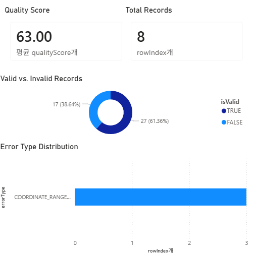

## 프로젝트 한 줄 소개

GeoJSON 및 CSV 공간데이터의 품질을 자동 검증하고, 품질 점수화와 BI 리포팅까지 지원하는 GIS 데이터 품질관리 플랫폼

---

## 결과 미리보기

### GeoQuality BI Dashboard



## 프로젝트 배경

공간데이터 기반 서비스에서는 데이터 품질이 분석 결과의 신뢰도를 결정합니다.

하지만 실제 데이터 수집 과정에서는 다음과 같은 문제가 자주 발생합니다.

* 잘못된 좌표값
* Geometry 누락
* 중복 객체
* 속성값 결측
* 이상치 데이터

이러한 오류는 분석 결과 왜곡, 지도 시각화 오류, 데이터 신뢰도 저하로 이어질 수 있습니다.

GeoQuality는 공간데이터 품질검사를 자동화하고, 결과를 시각적으로 제공하여 데이터 품질관리 업무를 효율화하기 위해 개발되었습니다.

---

## 핵심 문제 정의

### 문제 1. 공간데이터 품질 문제를 빠르게 파악하기 어렵다

GeoJSON, CSV 등의 공간데이터는 다양한 형태의 오류를 포함할 수 있으며, 수작업으로 검증하기 어렵습니다.

### 문제 2. 품질검사 결과를 활용하기 어렵다

오류를 발견하더라도 분석 및 보고에 활용할 수 있는 형태로 정리되지 않는 경우가 많습니다.

### 문제 3. GIS와 BI 분석이 분리되어 있다

품질검사 결과를 Tableau, Power BI 등 BI 도구로 연결하기 위해서는 추가 가공 작업이 필요합니다.

---

## 해결 방향

GeoQuality는 다음과 같은 흐름으로 문제를 해결합니다.

```text
공간데이터 업로드
↓
자동 품질검사
↓
품질 점수 계산
↓
오류 유형 분석
↓
BI Report CSV 생성
↓
Tableau / Power BI 연계
```

---

## 주요 기능

### 1. 공간데이터 업로드

지원 포맷

* GeoJSON
* CSV 좌표 데이터

---

### 2. 품질검사

GeoJSON

* Geometry 누락 검사
* Duplicate Geometry 탐지
* 속성값 결측치 검사

CSV

* 좌표 범위 오류 검사
* 유효 좌표 검증
* 품질 점수 계산

---

### 3. 품질 점수 계산

데이터 유효성을 기준으로 Quality Score를 계산합니다.

예시

```text
전체 데이터 3건
정상 데이터 2건
오류 데이터 1건

Quality Score = 67
```

---

### 4. 품질 대시보드

품질검사 결과를 BI Dashboard 형태로 제공합니다.

제공 지표

* Total Rows
* Valid Rows
* Invalid Rows
* Quality Score
* Error Types
* Export Ready Status

---

### 5. Error Type Distribution

품질검사 결과를 오류 유형별로 시각화합니다.

예시

```text
COORDINATE_RANGE_ERROR
MISSING_VALUE
DUPLICATE_GEOMETRY
GEOMETRY_MISSING
```

---

### 6. 지도 시각화

업로드된 공간데이터를 지도에서 확인할 수 있습니다.

제공 기능

* GeoJSON 지도 시각화
* CSV 좌표 지도 시각화
* 자동 지도 범위 조정

---

### 7. BI Report Export

품질검사 결과를 CSV 형태로 다운로드할 수 있습니다.

Export 컬럼

```text
rowIndex
latitude
longitude
errorType
message
isValid
qualityScore
```

Tableau, Power BI 등 BI 도구에서 바로 활용 가능합니다.

---

## 기술 스택

### Frontend

* React
* TypeScript
* Vite
* Tailwind CSS

### GIS

* Leaflet
* GeoJSON

### Visualization

* Recharts

### Data Processing

* TypeScript
* Custom Quality Validation Engine

### Deployment

* GitHub
* Vercel

---

## 시스템 아키텍처

```text
GeoJSON / CSV
        │
        ▼
 File Parser
        │
        ▼
 Quality Validation Engine
        │
        ├── Quality Score
        ├── Error Detection
        ├── Error Statistics
        │
        ▼
 Dashboard & Map Visualization
        │
        ▼
 BI Report CSV Export
```

---

## 프로젝트 구조

```text
src
├─ components
│  ├─ dashboard
│  ├─ map
│  └─ upload
│
├─ pages
│
├─ utils
│  ├─ fileParser.ts
│  └─ csvExport.ts
│
├─ types
│
└─ data
```

---

## 포트폴리오 어필 포인트

### GIS 데이터 품질관리 경험

* GeoJSON 데이터 검증
* 좌표 데이터 검증
* 공간데이터 품질 점수화

### 데이터 엔지니어링 경험

* 데이터 검증 파이프라인 설계
* 품질검사 결과 Dataset 생성
* CSV Export 설계

### BI 연계 경험

* Tableau / Power BI 활용 가능 구조 설계
* 품질검사 결과 시각화
* Dashboard 구성

### 프론트엔드 개발 경험

* React 기반 SPA 개발
* GIS 시각화 구현
* 데이터 시각화 구현

---

## 향후 개선 계획

### GIS

* Shapefile 지원
* PostGIS 연동
* CRS 자동 변환

### 공간분석

* Density Analysis
* Cluster Analysis (DBSCAN)
* Spatial Outlier Detection

### 머신러닝

* Isolation Forest 기반 이상치 탐지
* Rule 기반 검사와 비교 분석

### BI

* Power BI Dashboard 템플릿 제공
* Tableau Dashboard 템플릿 제공

### Backend

* FastAPI 서버 구축
* 비동기 파일 처리
* 검사 결과 저장 기능

---

## 프로젝트를 통해 배운 점

GeoQuality를 개발하며 단순한 파일 업로드 기능을 넘어 데이터 품질검사와 시각화, BI 연계까지 포함하는 데이터 파이프라인을 설계하는 경험을 할 수 있었습니다.

특히 GIS 데이터 검증 로직 구현, 품질 점수화, BI Report Dataset 설계를 통해 공간정보 시스템과 데이터 엔지니어링 관점을 함께 고려하는 방법을 학습할 수 있었습니다.
